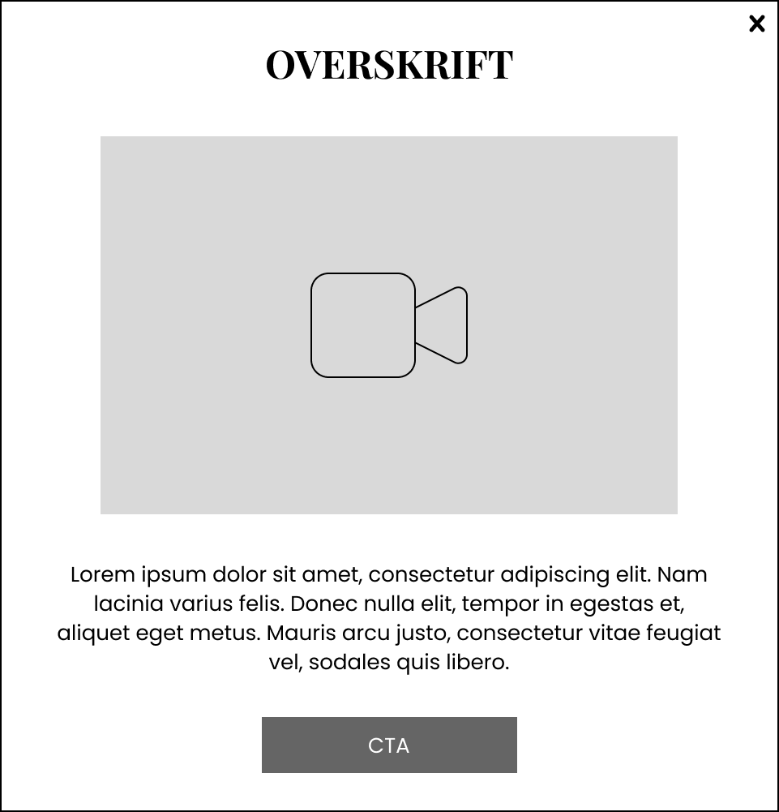
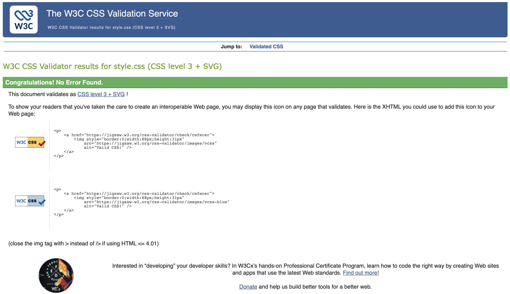
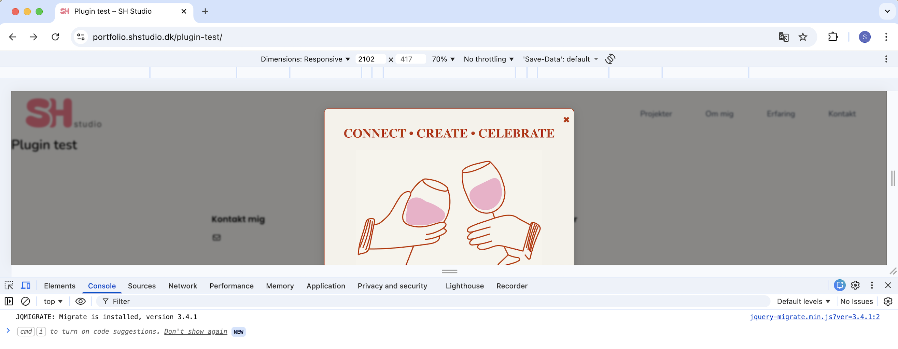
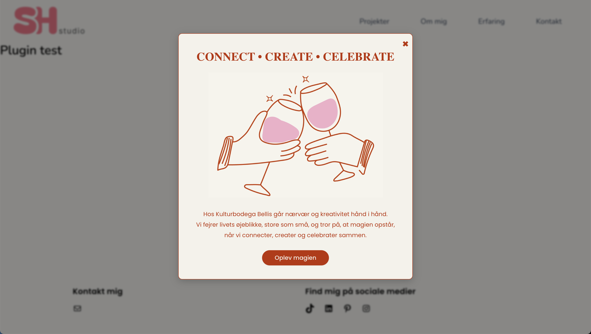

# Sarah's Bellis plugin
**Beskrivelse:** Plugin lavet som en pop-up med animationer, overlay og CTA-knap.

**Version:** 0.7

**Forfatter:** Sarah Heltborg Nielsen

---

## Formålet med mit plugin
Jeg har udviklet et plugin med henblik på at fange folks opmærksomhed og give dem lyst til at udforske Kulturbodega Bellis' univers.

Jeg har valgt at have et mørkt overlay bag min popup, da jeg på den måde sikrer, at brugeren har fokus på popup'en og ikke på indholdet bagved. Ydermere har jeg valgt at give popup-boksen en rød outline og en skygge, som sammen med mit overlay får den til at stå tydeligt frem.

Af indhold i min popup har jeg valgt at inkludere vores OI som overskrift, en animation, en kort men interessant tekst, en CTA-knap, der fører brugeren videre til "Bag Bellis"-siden, samt en luk-knap i øverste højre hjørne.

Jeg ville sikre, at der var en tydelig rød tråd mellem designet på vores side og min popup, og derfor har jeg benyttet vores to gennemgående farver - beige (#F4F2EA) og rød (#BD3001).<br>Derudover har jeg fastholdt vores tegnede stil og selv tegnet illustrationen i Adobe Illustrator, som jeg efterfølgende har animeret i Adobe After Effects for at skabe en subtil bevægelse der ikke forstyrrer brugeren i at læse teksten på min popup.

I den brødtekst, jeg har skrevet på popup'en, har det også været vigtigt for mig at implementere vores OI, så brugeren allerede fra start bliver præsenteret for den.

---

## Opbygning
### Filstruktur
Jeg har alt indhold til mit plugin i mappen: `wp-content/plugins/sarah_bellis_plugin`.

På trods af, at det kun er et enkelt plugin jeg har udviklet har jeg skabt en god struktur, både i min kode, men også i mine filer. Dette har jeg prioriteret for at sikre en nem videreudvikling af koden, hvis det skulle blive aktuelt på et tidspunkt.
```plaintext
sarah_bellis_plugin
├── css
│   └── style.css
├── index.php
├── js
│   └── script.js
├── mov
│   └── plugin-animation.mp4
└── README.md
```

### HTML og PHP
#### Plugin header
Jeg har startet min PHP-fil med en *plugin header*, som indeholder kommentarer, der fungerer som *metadata* for WordPress. Uden denne kommentarblok ville WordPress ikke læse filen som et plugin, men blot som en almindelig PHP-fil.

Ved `Plugin URI` har jeg valgt at linke til mit repository for Plugin'et på GitHub, da det er her, man ville kunne læse mere om mit plugin, hvis det var udgivet offentligt.<br>
Ved `Author URI` har jeg valgt at linke til min portfolio, da dette er et sted, hvor man kan læse mere om mig.

#### Sikkerhed
Jeg vil være sikker på, at mit plugin kun bliver læst og kørt inde i WordPress, derfor har jeg startet PHP-filen med følgende kode:

```php
 if (!defined('ABSPATH')) {
    exit;
}
```
Denne betingelse sørger for, at plugin'et ikke bliver vist hvis man prøver at åbne php-filen direkte i en browser. Det kan kun indlæses gennem WordPress systemet.

#### Funktioner
Jeg har først to funktioner der henter min CSS: `bellis_enqueue_styles()`, og JavaScript: `bellis_enqueue_scripts()`. <br>Jeg har valgt at placere dem øverst i filen, da PHP læses oppefra og ned. Det er derfor vigtigt, at styling og interaktivitet bliver hentet inden indholdet på siden indlæses.

Dernæst har jeg funktionen `bellis_popup_box()`, som indeholder mit HTML. Det er denne funktion, der skaber indholdet til min popup, og bestemmer rækkefølgen af elementerne.

Jeg starter med at oprette et mørkt overlay og gemme alt indholdet i PHP-variablen `$content`:
```php
    $content  = '<div id="popup-overlay"></div>'; 
```
Ved alt efterfølgende HTML jeg definerer i funktionen, skriver jeg `.=`. Det betyder, at jeg tilføjer nyt indhold til den allerede eksisterende tekst, til min PHP-variabel, jeg startede med at definere.

Dernæst tilføjer jeg `$content .= '<div id="bellis-container">';` som fungerer som container for alt indholdet i min popup. Inde i denne `<div>` definerer jeg alt mit HTML-indhold til popup'en.

Resten af mit indhold bliver tilføjet i den efterfølgende `<div>`:
```php
// Selve popup boksen
$content .= '<div class="bellis-box slide-top" id="bellis-box">';

// Luk-knap
$content .= '<div class="bellis-close-button" id="bellis-close">&#10006;</div>';

// Overskrift
$content .= '<h2>CONNECT • CREATE • CELEBRATE</h2>'; 

// Animationen bliver sat ind som en video
$content .= '<video id="plugin-video" autoplay muted loop> <source src="' . plugin_dir_url(__FILE__) . 'mov/plugin-animation.mp4" alt="Bellis animation"> </video>'; 

// Brødteksten
$content .= '<p>Hos Kulturbodega Bellis går nærvær og kreativitet hånd i hånd. <br> Vi fejrer livets øjeblikke, store som små, og tror på, at magien opstår, når vi connecter, creater og celebrater sammen.</p>';
    
// Min CTA-knap
$content .= '<div class="button-holder"><button id="bellis-button">Bliv en del af fællesskabet</button></div>';

// Lukker popup-div
$content .= '</div>';
```

Som det sidste i funktionen skriver jeg `return $content;`, hvilket betyder, at funktionen returnerer værdien af min PHP-variabel til det sted, hvor funktionen bliver kaldt. I dette tilfælde er det i WordPress, når jeg indsætter min shortcode.

#### Shortcode
Jeg har tilføjet en shortcode, som gør, at popup'en kan vises hvor som helst i WordPress, blot ved at indsætte min selvdefinerede shortcode `[sarah_bellis_popup]`.<br> 
Det har jeg gjort ved at tilføje: `add_shortcode('sarah_bellis_popup', 'bellis_popup_box');`, som kobler min shortcode sammen med funktionen `bellis_popup_box`. Det gør mit plugin fleksibelt og nemt at bruge.

---

### CSS
I min CSS-fil har jeg stylet både layout, elementer og animationer for at gøre mit plugin interessant og brugervenligt.<br>
Jeg har anvendt `!important` flere steder i min CSS, da WordPress ellers ville overskrive min styling. Jeg har dog fjernet det i mine kodeeksempler her i README'en, da det ser pænere ud og er mere læsbart uden.

#### Layout og placering
For at sikre, at min popup er placeret midt i *viewporten*, uanset skærmstørrelse, har jeg stylet containeren således:
```css
#bellis-container {
    position: fixed;
    top: 10%; /* Afstand fra toppen */
    left: 50%; /* Venstre kant sættes midt på skærmen */
    transform: translateX(-50%); /* Træk 50% af containerens bredde fra og sikrer dermed horisontal centrering */
    z-index: 9999;
    width: 100%;
    max-width: 600px;
    pointer-events: none;
}
```
Denne styling sikrer, at popup'en forbliver centreret på skærmen, også når brugeren scroller på indholdet bagved.

#### Overlay
Jeg har valgt at tilføje et overlay bag min popup for at lede brugerens opmærksomhed hen på min popup. Stylingen ser således ud:

```css
#popup-overlay {
  position: fixed;                /* Dækker hele skærmen uanset om brugeren scroller */
  inset: 0;                       /* Top, bund, venstre, højre = 0 (giver fuld dækning) */
  background: rgba(0, 0, 0, 0.45); /* Gennemsigtig sort baggrund */
  backdrop-filter: blur(2px);     /* Lidt blur på baggrunden */
  z-index: 9998;                  /* Ligger under pop-up-boksen, men over alt andet på siden */
  opacity: 0;                     /* Starter usynlig */
  transition: opacity 0.4s ease;  /* Glidende fade-effekt når overlay vises/skjules */
  pointer-events: none;           /* Ignorér klik, indtil det bliver gjort aktivt */
}

/* -- Når popup er aktiv vises overlay -- */
#popup-overlay.active {
  opacity: 1;                     /* Gør overlay synligt */
  pointer-events: all;            /* Gør overlay klikbart, så man kan lukke pop-up ved at trykke her */
}
```

I ovenstående styling vil jeg særligt fremhæve, at jeg har gjort overlayet klikbart, da jeg har erfaret, at mange brugere intuitivt vil forsøge at lukke popup'en ved at klikke uden for den.<br> 
Derudover har jeg tilføjet en glidende overgang på overlayet, så det bliver en lidt blødere bevægelse og er mere behageligt at se på når det vises og skjules.

#### CTA-knap
Selvom jeg har gjort det nemt at lukke min popup, vil jeg gerne have, at brugeren klikker på min CTA. Derfor har jeg gjort knappen særligt tydelig ved at give den en iøjefaldende dækkende farve og tilføje en hover-effekt, hvor jeg bytter rundt på farverne, så det tydeligt fremgår, at den er klikbar.

```css
.button-holder button {
    font-family: "Poppins", sans-serif;
    font-size: 15px;
    padding: 10px 20px; /* Luft inde i knappen */
    background: #BD3001;
    color: #F4F2EA; /* Farve på teksten */
    border: 2px solid #BD3001;
    border-radius: 30px;
    cursor: pointer; /* Cursor bliver til en hånd ved hover */
    transition: all 0.3s ease; /* Sikrer glidende overgang ved hover */
}

.button-holder button:hover {
    background: #F4F2EA;
    border: 2px solid #BD3001;
    color: #BD3001; /* Farve på teksten */
}
```


#### CSS-animation
Jeg bruger flere forskellige CSS-animationer i mit plugin.<br>
Den første animation, der bliver aktiveret, er, når popup'en skal vises. Den er lavet ved hjælp af både CSS og JS. I CSS har jeg lavet en slide-effekt for at lede fokus hen på popup'en, og den er lavet på følgende måde:

```css
/* -- Start-position for popup (skjult over toppen) -- */
.slide-top {
    transform: translateY(-150%); /* Boksen skubbes langt over viewporten så den ikke kan ses */
    opacity: 0; /* Gør boksen usynlig */
}

/* -- Synlig position -- */
.slide-down {
    transform: translateY(0); /* Flytter boksen ned på plads*/
    opacity: 1; /* Gør boksen synlig */
}
```
Den bliver aktiveret i JavaScript.

<br>Den næste animation, der bliver aktiveret, er den, hvor min overskrift først bliver synlig lidt efter resten af indholdet i popup'en.<br> Koden ser således ud:
```css
.bellis-box h2 {
    color: #BD3001;
    font-family: "Playfair Display", serif;
    font-size: 30px;
    font-weight: bold;
    margin: 20px;
    opacity: 0; /* Skjuler overskriften */
    transform: scale(0); /* Starter helt lille */
    transform-origin: center top; /* Teksten bliver synlig fra midten af toppen */
}

/* -- Effekt på overskriften -- */
.bellis-box.slide-down h2 {
    animation: h2ScaleIn 0.6s ease-out 1s forwards; /* Definerer og styler animationen af overskriften. Den køres efter 1 sek og varer 0.6 sek */
}

@keyframes h2ScaleIn {
    from { opacity: 0; transform: scale(0); } /* Overskriften starter usynlig og lille */
    to   { opacity: 1; transform: scale(1); } /* Overskriften slutter synlig og normal størrelse */
}
```

Jeg har valgt denne animation for sætte fokus på "Connect • Create • Celebrate", som også er vores *Organizing Idea (OI)*. Ved at bruge vores *OI* som overskrift introduceres brugeren tidligt til konceptet bag Kulturbodega Bellis. Samtidig skaber det en genkendelse mellem popup'en og resten af sitet, da ordene går igen flere steder i vores digitale løsning.

---

### JavaScript
Jeg har brugt *Vanilla JavaScript* frem for *jQuery* for at gøre koden mere enkel og let at forstå, forbedre *page load time* og få bedre kontrol over, hvordan koden fungerer.

Jeg bruger JavaScript til at aktivere de animationer, jeg har stylet i CSS på min popup.<br>
Jeg starter med at sikre, at alt indhold på siden er indlæst, før animationerne aktiveres, ved at skrive: `document.addEventListener('DOMContentLoaded', startPopup);`.

Dernæst definerer jeg funktionen `startPopup`.<br>
Øverst i funktionen definerer jeg mine variabler, så jeg nemt kan tilgå dem senere i koden:
```js
  var boks = document.getElementById('bellis-box');
  var overlay = document.getElementById('popup-overlay');
  var lukKnap = document.getElementById('bellis-close');
  var ctaKnap = document.getElementById('bellis-button');
  ```
Jeg har stylet animationen i CSS, men det er i JavaScript, jeg bestemmer, hvornår og hvor hurtigt animationen skal aktiveres.<br>
Jeg vil have, at der går 1 sekund fra siden er indlæst, til min popup bliver vist. Det skriver jeg inde i `startPopup`-funktionen på denne måde: `setTimeout(function(){visPopup(boks, overlay);}, 1000);`.

Da jeg gerne vil have, at popup'en forsvinder, når der bliver trykket på overlayet eller på luk-knappen, definerer jeg også det i funktionen:
```js
  lukKnap.addEventListener('click', function(){
    skjulPopup(boks, overlay);
  });
  
  overlay.addEventListener('click', function(){
    skjulPopup(boks, overlay);
  });
  ```

Som det sidste i funktionen skriver jeg, at hvis brugeren trykker på min CTA, skal funktionen `visSiden` køre: `ctaKnap.addEventListener('click', visSiden);`.

Hvad der præcis skal ske i funktionerne `visPopup`, `skjulPopup` og `visSiden`, definerer jeg også i JS:

```js
// Viser pop-up
function visPopup(boks, overlay){
  boks.classList.remove('slide-top');
  boks.classList.add('slide-down');
  overlay.classList.add('active');
}

//Skjuler pop-up
function skjulPopup(boks, overlay){
  boks.classList.remove('slide-down');
  boks.classList.add('slide-top');
  overlay.classList.remove('active');
}

//Sender brugeren videre
function visSiden(event){
  event.preventDefault();
  window.location.href = 'https://storyscaping.shstudio.dk/elementor-615/home/';
}
```
Her tilføjer og fjerner jeg CSS-klasser alt efter, hvordan brugeren interagerer med elementerne. I `visSiden` linker jeg til vores *Bag Bellis*-side, da det er her, brugeren skal føres hen, når de trykker på CTA-knappen.


---

## Shortcode
For at kunne vise mit plugin i WordPress har jeg oprettet en *shortcode* i min *PHP-fil*, hvor jeg har derfineret, at den skal hedde `[sarah_bellis_popup]`.

Det betyder, at jeg kan implementere plugin'et på alle sider ved at indsætte *shortcoden* direkte i *teksteditoren* i WordPress. Når WordPress læser shortcoden, henter den det indhold, jeg har bygget i mit plugin. På den måde er det nemt at placere popup'en på lige præcis den side, hvor det giver mest mening.

---

## Skitse, wireframe og mockup
Min proces med at udvikle mit plugin startede med, at jeg lavede flere skitser. Jeg lod kreativiteten få frit løb og tegnede mange forskellige idéer. Dette er den skitse, jeg endte med at arbejde ud fra.<br>


Dernæst lavede jeg en *wireframe* ud fra min skitse i Figma. Her havde jeg mere fokus på struktur og layout end i skitsefasen. På dette tidspunkt tænkte jeg dog endnu ikke i specifikt content eller farver.<br>


Da jeg havde lavet en *wireframe*, jeg var tilfreds med, gik jeg videre til at lave *mockups*. Her lavede jeg også flere forskellige versioner og eksperimenterede med forskelligt indhold. Dette er den version, jeg valgte at kode ud fra.<br>


---

## Validering af koden
Jeg har valgt at validere min CSS og JavaScript for at sikre, at koden følger standarderne og ikke indeholder fejl, der kan påvirke funktionaliteten. Valideringen hjælper mig bl.a. med at finde små *syntaksfejl* som jeg måske har overset.<br>

**CSS**<br>
Jeg har brugt *Jigsaw W3C CSS Validator* til at validere min CSS, og den viste, at der ikke var nogen fejl i min kode.<br>


**JavaScript**<br>
JavaScript valideres typisk via browserens konsol, hvor der bliver vist fejl og advarsler. Her viste den også, at der ikke var nogen fejl i min kode.<br>
<br>
Beskeden i konsollen betyder, at WordPress automatisk har indlæst biblioteket *jQuery Migrate*. Det bruges til at sikre, at kode, der er skrevet i ældre versioner af *jQuery*, stadig fungerer i WordPress. Da jeg har skrevet min kode i *Vanilla JavaScript*, er denne besked ikke relevant for mig.

---

## Mit plugin
Her vises et screenshot af mit færdige plugin, som det ser ud, når det er aktiveret på en WordPress-side.<br>
